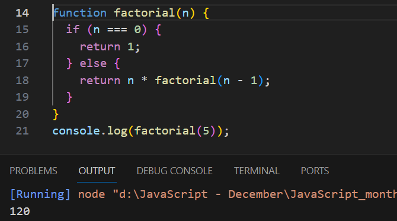
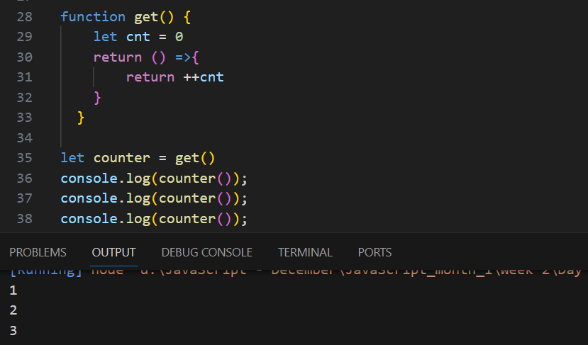

# Рекурсия
Рекурсия в JavaScript - это процесс, при котором функция вызывает саму себя до тех пор, пока не будет достигнут определенный результат. Это позволяет более эффективно решать задачи, которые требуют итеративных алгоритмов или циклов.

Вот пример рекурсивной функции, которая вычисляет факториал числа:

В этом примере функция `factorial` вызывает саму себя, пока n не станет равным 0. Когда n равно 0, функция возвращает 1. Затем каждый вызов функции `factorial` возвращает произведение n и результата вызова `factorial`(n - 1), пока n не станет равным 0.

# Замыкание

Замыкание — это функция JavaScript, которая позволяет функции получать доступ к переменным из внешней функции, которая уже вернулась. Другими словами, замыкание дает вам доступ к области видимости внешней функции из внутренней функции. Замыкания создаются каждый раз при создании функции, во время создания функции.

